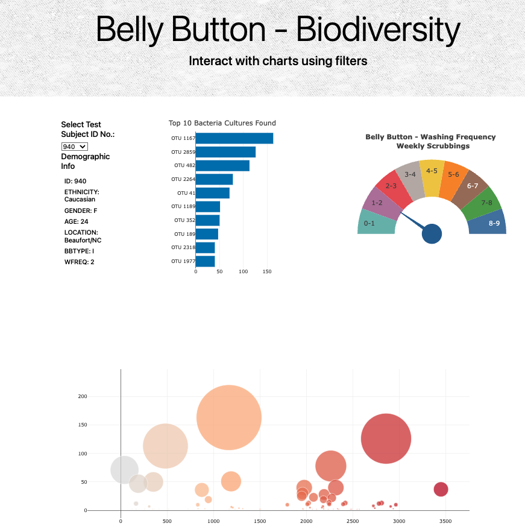

# Module 12 - Ployly - Belly Button Biodiversity

## OVERVIEW
Roza has a partially completed dashboard that she needs to finish. She has a completed panel for demographic information and now needs to visualize the bacterial data for each volunteer. Specifically, her volunteers should be able to identify the top 10 bacterial species in their belly buttons. That way, if Improbable Beef identifies a species as a candidate to manufacture synthetic beef, Roza's volunteers will be able to identify whether that species is found in their navel.

## RESULTS
Using Javascripts, Plotly and d3.js, we have created an [interactive dashboard](https://hinasaeed-691.github.io/belly_button_biodiversity/) the shows the top 10 bacterial species (OTUs) when an individual’s ID is selected from the dropdown menu on the webpage.

  
